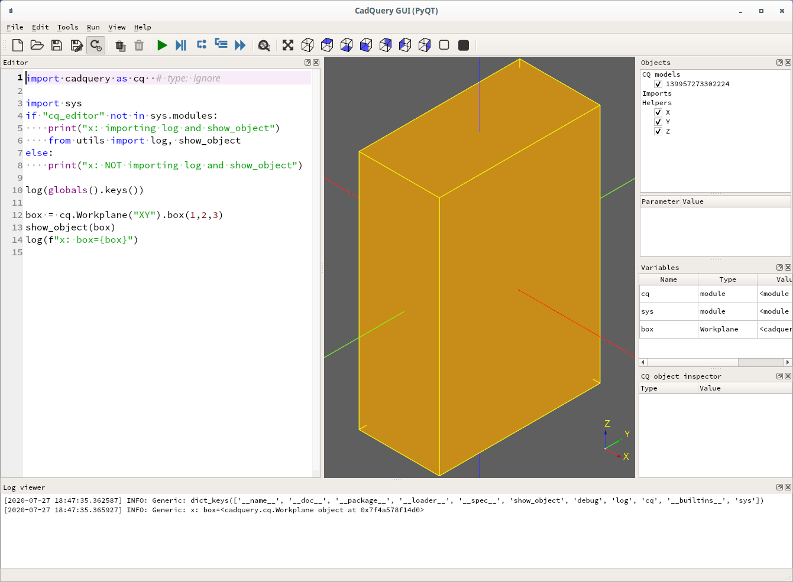
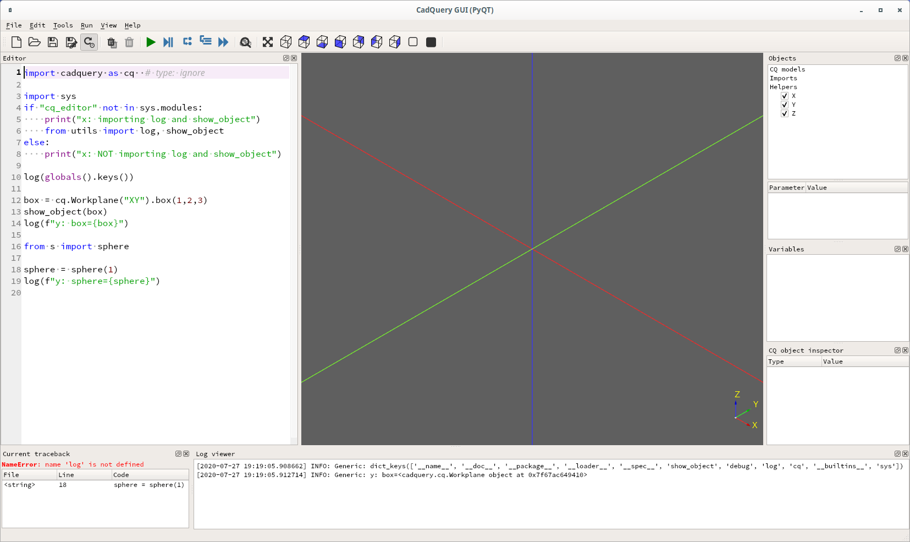
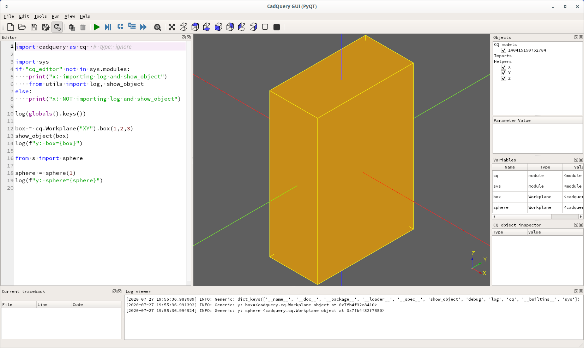

# CQ utils

An attempt to create a utility module which allows a python
application/module to be used with straight python or cq-editor.
At the moment it doesn't work the way I want it when using additional
modules, but works fine if everything is in the main module.

[Here](https://groups.google.com/g/cadquery/c/ofvIsCJJK5M/m/_3Qqw9LICQAJ)
Adam suggests conditionally including `utils.py` if `cq_editor` isn't
in sys.modules:

```
import sys

if 'cq_editor' not in sys.modules:
    from utils import log, show_object
```

This works fine if the entire application is in the main module. For
example `x.py`:
```
(cq-dev) wink@3900x:~/prgs/CadQuery/projects/utils (master)
$ cat -n x.py
     1	import cadquery as cq  # type: ignore
     2	
     3	import sys
     4	if "cq_editor" not in sys.modules:
     5	    print("x: importing log and show_object")
     6	    from utils import log, show_object
     7	else:
     8	    print("x: NOT importing log and show_object")
     9	
    10	log(globals().keys())
    11	
    12	box = cq.Workplane("XY").box(1,2,3)
    13	show_object(box)
    14	log(f"x: box={box}")
```
Now if you run `python x.py` you see `x: importing log and show_object`
and all of the log statemets get printed to the terminal:
```
(cq-dev) wink@3900x:~/prgs/CadQuery/projects/utils (master)
$ python x.py
x: importing log and show_object
dict_keys(['__name__', '__doc__', '__package__', '__loader__', '__spec__', '__annotations__', '__builtins__', '__file__', '__cached__', 'cq', 'sys', 'log', 'show_object'])
utils.show_object: vars={'plane': <cadquery.occ_impl.geom.Plane object at 0x7f609db2dd50>, 'objects': [<cadquery.occ_impl.shapes.Solid object at 0x7f60b02d47d0>], 'parent': <cadquery.cq.Workplane object at 0x7f609e7c2210>, 'ctx': <cadquery.cq.CQContext object at 0x7f609e6a3ed0>, '_tag': None}
x: box=<cadquery.cq.Workplane object at 0x7f609e097cd0>
```

If you run `cq-editor x.py` and then click on the cq-editor `RUN` button we see in the
terminal `x: NOT importing log and show_object`, which exactly what we'd expect:
```
(cq-dev) wink@3900x:~/prgs/CadQuery/projects/utils (master)
$ cq-editor x.py
Namespace(filename='x.py')
TKOpenGl | Type: Other | ID: 0 | Severity: Medium | Message:
  OpenGl_Window::CreateWindow: window Visual is incomplete: no stencil buffer
Font_FontMgr, warning: unable to find font 'Courier' [regular]; 'Cantarell' [aspects: regular,bold] [paths: /usr/share/fonts/cantarell/Cantarell-Regular.otf;/usr/share/fonts/cantarell/Cantarell-Bold.otf] is used instead
x: NOT importing log and show_object
```

And the box is shown in cq-editor with log statements are showing up in
the log window of cq-editor:




Next, if we introduce an intermediate module, `s.py`:
```
(cq-dev) wink@3900x:~/prgs/CadQuery/projects/utils (master)
$ cat -n s.py
     1	import cadquery as cq  # type: ignore
     2	
     3	import sys
     4	if "cq_editor" not in sys.modules:
     5	    print("s: importing log and show_object")
     6	    from utils import log, show_object
     7	else:
     8	    print("s: NOT importing log and show_object")
     9	
    10	print(f"s: {globals().keys()}")
    11	
    12	def sphere(radius: float) -> cq.Workplane:
    13	    log(f"s: radius={radius}")
    14	    s = cq.Workplane("XY").sphere(radius)
    15	    show_object(s)
    16	    return s
```
And create `y.py` which is similar to `x.py` but also uses `s.py`:
```
(cq-dev) wink@3900x:~/prgs/CadQuery/projects/utils (master)
$ cat -n y.py
     1	import cadquery as cq  # type: ignore
     2	
     3	import sys
     4	if "cq_editor" not in sys.modules:
     5	    print("x: importing log and show_object")
     6	    from utils import log, show_object
     7	else:
     8	    print("x: NOT importing log and show_object")
     9	
    10	log(globals().keys())
    11	
    12	box = cq.Workplane("XY").box(1,2,3)
    13	show_object(box)
    14	log(f"y: box={box}")
    15	
    16	from s import sphere
    17	
    18	sphere = sphere(1)
    19	log(f"y: sphere={sphere}")

(cq-dev) wink@3900x:~/prgs/CadQuery/projects/utils (master)
$ diff x.py y.py
14c14,19
< log(f"x: box={box}")
---
> log(f"y: box={box}")
> 
> from s import sphere
> 
> sphere = sphere(1)
> log(f"y: sphere={sphere}")```
```
Then run `python y.py`, it's perfect. we see all of the output on the terminal:
```
(cq-dev) wink@3900x:~/prgs/CadQuery/projects/utils (master)
$ python y.py
x: importing log and show_object
dict_keys(['__name__', '__doc__', '__package__', '__loader__', '__spec__', '__annotations__', '__builtins__', '__file__', '__cached__', 'cq', 'sys', 'log', 'show_object'])
utils.show_object: vars={'plane': <cadquery.occ_impl.geom.Plane object at 0x7fda1e6f9910>, 'objects': [<cadquery.occ_impl.shapes.Solid object at 0x7fda30ea1890>], 'parent': <cadquery.cq.Workplane object at 0x7fda1f38f7d0>, 'ctx': <cadquery.cq.CQContext object at 0x7fda1ebf2c10>, '_tag': None}
y: box=<cadquery.cq.Workplane object at 0x7fda1f3c3350>
s: importing log and show_object
s: dict_keys(['__name__', '__doc__', '__package__', '__loader__', '__spec__', '__file__', '__cached__', '__builtins__', 'cq', 'sys', 'log', 'show_object'])
s: radius=1
utils.show_object: vars={'plane': <cadquery.occ_impl.geom.Plane object at 0x7fda1e6f9ad0>, 'objects': [<cadquery.occ_impl.shapes.Solid object at 0x7fda1e6f9f50>], 'parent': <cadquery.cq.Workplane object at 0x7fda1ec64e50>, 'ctx': <cadquery.cq.CQContext object at 0x7fda1f5fa650>, '_tag': None}
y: sphere=<cadquery.cq.Workplane object at 0x7fda1e6f9d50>
```

So we run `cq-editor y.py` in the terminal we see two
`NOT importing log and show_object` messages, which is nice. But neither
`log` or `show_object` are defined in `s: dict_keys([...])`:
```
(cq-dev) wink@3900x:~/prgs/CadQuery/projects/utils (master)
$ cq-editor y.py
Namespace(filename='y.py')
TKOpenGl | Type: Other | ID: 0 | Severity: Medium | Message:
  OpenGl_Window::CreateWindow: window Visual is incomplete: no stencil buffer
Font_FontMgr, warning: unable to find font 'Courier' [regular]; 'Cantarell' [aspects: regular,bold] [paths: /usr/share/fonts/cantarell/Cantarell-Regular.otf;/usr/share/fonts/cantarell/Cantarell-Bold.otf] is used instead
x: NOT importing log and show_object
s: NOT importing log and show_object
s: dict_keys(['__name__', '__doc__', '__package__', '__loader__', '__spec__', '__file__', '__cached__', '__builtins__', 'cq', 'sys'])
```
And if we look at the cq-editor app we see `NameError: 'log' is not defined` message in the
Current traceback window of cq-editor:




A fix is to change the if statement in `s.py` to use `globals().keys()`
instead of `sys.modules`:
```
(cq-dev) wink@3900x:~/prgs/CadQuery/projects/utils (master)
$ cat -n s.py
     1	import cadquery as cq  # type: ignore
     2	
     3	import sys
     4	#if "cq_editor" not in sys.modules:
     5	if "cq_editor" not in globals().keys():
     6	    print("s: importing log and show_object")
     7	    from utils import log, show_object
     8	else:
     9	    print("s: NOT importing log and show_object")
    10	
    11	print(f"s: {globals().keys()}")
    12	
    13	def sphere(radius: float) -> cq.Workplane:
    14	    log(f"s: radius={radius}")
    15	    s = cq.Workplane("XY").sphere(radius)
    16	    show_object(s)
    17	    return s
```
And runing `python y.py` continues to do the right thing and import from utils:
```
(cq-dev) wink@3900x:~/prgs/CadQuery/projects/utils (master)
$ python y.py
x: importing log and show_object
dict_keys(['__name__', '__doc__', '__package__', '__loader__', '__spec__', '__annotations__', '__builtins__', '__file__', '__cached__', 'cq', 'sys', 'log', 'show_object'])
utils.show_object: vars={'plane': <cadquery.occ_impl.geom.Plane object at 0x7fbb0cb2d810>, 'objects': [<cadquery.occ_impl.shapes.Solid object at 0x7fbb1f2d5890>], 'parent': <cadquery.cq.Workplane object at 0x7fbb0da44fd0>, 'ctx': <cadquery.cq.CQContext object at 0x7fbb0d096c50>, '_tag': None}
y: box=<cadquery.cq.Workplane object at 0x7fbb0d94c310>
s: importing log and show_object
s: dict_keys(['__name__', '__doc__', '__package__', '__loader__', '__spec__', '__file__', '__cached__', '__builtins__', 'cq', 'sys', 'log', 'show_object'])
s: radius=1
utils.show_object: vars={'plane': <cadquery.occ_impl.geom.Plane object at 0x7fbb0cb2dd10>, 'objects': [<cadquery.occ_impl.shapes.Solid object at 0x7fbb0cb2dfd0>], 'parent': <cadquery.cq.Workplane object at 0x7fbb0d027950>, 'ctx': <cadquery.cq.CQContext object at 0x7fbb0d098e10>, '_tag': None}
y: sphere=<cadquery.cq.Workplane object at 0x7fbb0cb2d7d0>
```
And now when we run `cq-editor y.py` we see the terminal has `x: NOT importing log and show_object`
and `s: importing log and show_object`:
```
(cq-dev) wink@3900x:~/prgs/CadQuery/projects/utils (master)
$ cq-editor y.py
Namespace(filename='y.py')
TKOpenGl | Type: Other | ID: 0 | Severity: Medium | Message:
  OpenGl_Window::CreateWindow: window Visual is incomplete: no stencil buffer
Font_FontMgr, warning: unable to find font 'Courier' [regular]; 'Cantarell' [aspects: regular,bold] [paths: /usr/share/fonts/cantarell/Cantarell-Regular.otf;/usr/share/fonts/cantarell/Cantarell-Bold.otf] is used instead
x: NOT importing log and show_object
s: importing log and show_object
s: dict_keys(['__name__', '__doc__', '__package__', '__loader__', '__spec__', '__file__', '__cached__', '__builtins__', 'cq', 'sys', 'log', 'show_object'])
s: radius=1
utils.show_object: vars={'plane': <cadquery.occ_impl.geom.Plane object at 0x7fb4f32f7c10>, 'objects': [<cadquery.occ_impl.shapes.Solid object at 0x7fb4f32f7710>], 'parent': <cadquery.cq.Workplane object at 0x7fb4f8335b90>, 'ctx': <cadquery.cq.CQContext object at 0x7fb4f32e8b10>, '_tag': None}
```

But since `s.py` is using `utils.py` for `log` and `show_object` we don't see the sphere or
the log statements in `cq-editor`:


